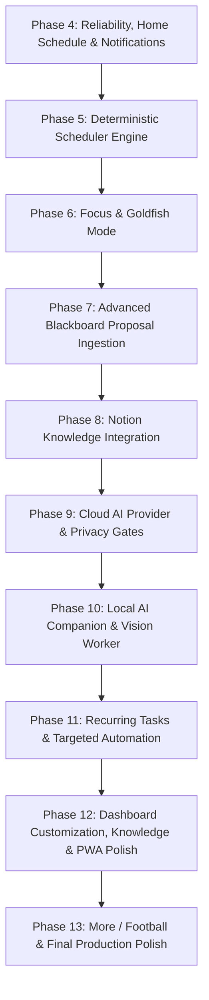

# Project Redline — Authoritative Product Roadmap

Last updated: August 2026.
Authoritative source of truth for Project Redline / Forward product direction, feature status, dependency ordering, and architectural gates.

---

## Status Classification Legend

- **`IMPLEMENTED`**: Fully built, verified by automated test/typecheck/lint/build, and active in the repository.
- **`PARTIALLY IMPLEMENTED`**: Foundation, types, or initial endpoints exist; UI, scheduling, or runtime logic remains incomplete.
- **`PLANNED`**: Fully specified and scheduled for a specific future phase.
- **`DEFERRED`**: Intentionally reserved for a later milestone to protect early-phase velocity; **NOT REMOVED**.
- **`ARCHITECTURE REVIEW REQUIRED`**: Blocked on dedicated security, data-integrity, or sync-semantics review before implementation.
- **`OUT OF SCOPE`**: Intentionally excluded to protect single-user focus and avoid commercial/multi-tenant/brittle complexity.

---

## 1. Product Foundations & Core Principles

Project Redline is a **private, single-user personal productivity and school operating system**. It combines the strongest ideas from:
1. **Task Management** (TickTick-style rapid capture, smart views, priority, deadlines, and multi-session planning)
2. **Structured Knowledge** (Markdown notes, attachments, task/course relationships, and Notion integration)
3. **Calendar Planning** (Multi-source conflict-free projection, Google Calendar mirrors, and school timetables)
4. **School Operations** (Course management, recurring class meetings, and safe Blackboard integration)
5. **Deterministic Automation** (Mathematical scheduling, automated proposal generation, and quiet hours)
6. **Optional AI Assistance** (Local companion daemon and cloud LLMs strictly adhering to a Propose → Review → Commit lifecycle)

### Non-Negotiable Constraints
- **Single-User Architecture:** Do NOT introduce multi-tenancy, team roles, billing, organizations, generic plugin marketplaces, or enterprise abstractions.
- **Separate Entity Domains:** Tasks, native calendar events, task work sessions, course meetings, and external calendar mirrors MUST remain distinct persistence domains. A task or work session rendered on a calendar does NOT become a calendar event.
- **Source-Aware Integrations:** External data from Google Calendar or Blackboard must preserve provider identity and never silently convert into native application entities.
- **Zero-AI Guarantee:** The core application (capture, tasks, calendar, notes, school, and scheduler) MUST remain 100% functional with zero AI connectivity.

---

## 2. Completed Phases (P0 – P3)

The following phases are **COMPLETED** and must not be rewritten or renumbered:

### Phase 0: SSRF & Blackboard Calendar Hardening [`IMPLEMENTED`]
- Fixed Node DNS pinned lookup contract (`options.all === true`) preventing `ERR_INVALID_IP_ADDRESS`.
- Implemented strict SSRF defenses: IPv4/IPv6 private/reserved address rejection, all-answer DNS verification, and manual redirect re-classification.
- Migrated Blackboard feed sync to write source-aware `external_records` without mutating native tasks.
- Isolated unused `announcements` database table as inert technical debt.

### Phase 1: Visual Foundations, Application Shell & Core Domains [`IMPLEMENTED`]
- **Visual Foundation:** Semantic tokens (`src/styles/tokens.css`), Tailwind 4 integration, composited CSS motion (`src/styles/motion.css`), System/Dark/Light appearance switching with zero-flash head bootstrap.
- **Application Shell:** Desktop sidebar, iOS safe-area mobile bottom tab bar (`Home`, `Tasks`, `Calendar`, `School`, `More`), and `Ctrl+K` navigation command palette.
- **Tasks Domain:** 7 smart views (`inbox`, `today`, `tomorrow`, `next7`, `overdue`, `completed`, `someday`), quick add, task modal editor, subtasks, priorities, and `submitted` vs `completed` semantics.
- **Calendar Domain:** Month grid, 7-day Week surface, Agenda list, multi-source `CalendarEntry` read model, and native event editor.
- **School Domain:** Courses catalog with custom colors and weekly recurring class timetable projected onto the Calendar.
- **Notes Domain:** Private Markdown notes with 900ms debounced autosave, task/course linking, search, and private Supabase Storage attachments.
- **PWA & Offline Foundations:** `/sw.js` service worker, `manifest.webmanifest`, IndexedDB offline mutation queue, and `/api/offline/mutations` optimistic replay handler.

### Phase 2: Reversible Universal Capture [`IMPLEMENTED`]
- `Ctrl/Cmd+Shift+Space` global overlay launcher and persistent UI triggers.
- Immutable raw capture storage in `captures` table with kind and timestamp tracking.
- Deterministic title/due-date parser generating reviewable task proposals without LLMs.
- Atomic commit RPC creating Inbox tasks and operation batches with a 10-minute safe undo window.

### Phase 3: Task Work Sessions & External Calendar Mirroring [`IMPLEMENTED`]
- Multi-session task planning via owner-scoped `task_work_sessions` table.
- Calendar work session editor and multi-session calendar projection.
- External calendar platform (`external_calendar_accounts`, `external_calendars`, `external_calendar_events`) with strict capability enforcement (`hasCalendarCapabilities`).
- Google Calendar read-only integration with OAuth 2.0 PKCE, AES-256-GCM encrypted token envelopes, SHA-256 state hashing, incremental sync tokens, and `410 Gone` recovery.

---

## 3. Remaining Implementation Roadmap (Phases 4 – 13)

### Phase 4: Reliability, Home Schedule & Personal Notifications
- **4A: Code Hygiene & Formatting Cleanup [`PLANNED` | Small | Risk: Low | Model: Local Qwen]**
  - Unminify condensed single-line source files (`note-workspace.tsx`, `notes/page.tsx`, `offline/mutations/route.ts`, `blackboard/page.tsx`, `school/page.tsx`).
  - Delete unreferenced `SectionPlaceholder` component and styles.
- **4B: Home Next Class & Today's Classes Canonical Projection [`COMPLETE` | Small | Risk: Low | Model: Gemini 3.7 Flash]**
  - Project canonical School course meeting data directly to Home without separate timetable storage.
  - Next Class card with active/in-progress precedence, time until start/end, location fallback, and next-day lookup.
  - Today's Classes card projecting today's schedule in chronological order with past/in-progress/upcoming classification.
- **4C: In-App Notification Center & User Preference UI [`COMPLETE` | Medium | Risk: Low | Model: Gemini 3.7 Flash]**
  - Build an in-app notification drawer/tray in the application shell with unread/read state and safe deep-link navigation.
  - Create notification settings on `/more` and `/settings/notifications` for configuring quiet hours start/end times, category delivery toggles, and deliberate Web Push enablement.
- **4D: Web Push Background Dispatch Engine [`COMPLETE` | Medium | Risk: Moderate | Model: Gemini 3.7 Flash]**
  - Implement the background notification dispatch worker (evaluating upcoming deadlines, calendar reminders, and course meeting reminders against user quiet hours, staleness rules, and deduplication keys).
  - Standards-compatible RFC 8291 (`aes128gcm`) Web Push payload encryption and RFC 8292 VAPID authorization through the maintained `web-push` package.
  - Secure cron / manual trigger endpoint `/api/notifications/dispatch`: cron-secret GET/POST may process the authenticated user registry, while session-authenticated manual dispatch is POST-only and owner-scoped.
  - Production automation remains a deployment configuration step: configure an HTTPS scheduler to call `GET /api/notifications/dispatch` with `Authorization: Bearer <CRON_SECRET>` on the chosen cadence.

### Phase 5: Deterministic Scheduler Engine (P8 Core)
- **5A: Pure Scheduling Engine Algorithm [`COMPLETE` | Medium | Risk: Moderate | Model: Claude Sonnet / Gemini 3.1 Pro]**
  - Implement pure, mathematical scheduling algorithm (`src/features/planning/scheduler-engine.ts`) operating on `SchedulerInput` (tasks, deadlines, estimated duration, fixed commitments, preferred work windows, breaks, and buffers).
  - Produce deterministic `ProposedWorkSession` assignments and explicit unscheduled reasons.
- **5B: "Plan My Day" & "What Should I Do Now?" UX [`COMPLETE` | Medium | Risk: Low | Model: Gemini 3.7 Flash]**
  - Interactive planning view presenting calculated proposals with one-click acceptance.
  - Conversional flow committing approved proposals directly into `task_work_sessions`.

### Phase 6: Focus & Goldfish Mode (P9 Presentation Layer)
- **6A: Focus Presentation Filter Domain [`COMPLETE` | Small | Risk: Low | Model: Gemini 3.7 Flash]**
  - Pure presentation filter isolating today's immediate commitments, next task, hard deadlines, and active work session while hiding backlog noise.
  - Strict zero-guilt interface guidelines (no overdue shame counters, no red alert styling).
- **6B: Fullscreen Focus Dashboard Mode [`COMPLETE` | Medium | Risk: Low | Model: Gemini 3.7 Flash]**
  - Dedicated distraction-free view with optional minimal timer and keyboard navigation.

### Phase 7: Advanced Blackboard Proposal Ingestion & Academic Automation
- **7A: Blackboard Assignment & Deadline Proposal Engine [`COMPLETE` | Architecture gate approved | Medium | Risk: High | Reviewer: Codex]**
  - Detect newly synchronized items in `external_records` and emit structured proposal objects to Universal Capture.
  - Enable one-click user review and conversion into native Redline tasks without automated task pollution.
  - Approved architecture: one stable proposal per stable provider-UID record, semantic-revision refresh/reopen rules, explicit capture commit/undo, and source-aware notification dedupe. UID-less fallback records remain mirrors only. See `docs/FORWARD_ARCHITECTURE.md` section 7.
- **7B: Secure School Change Notifications [`COMPLETE` | Small | Risk: Low | Model: Gemini 3.7 Flash]**
  - Trigger in-app and push notifications for newly detected syllabus or deadline changes with direct links to the proposal review view.
- **7C: Manual Blackboard-to-Course Mapping & Deterministic Task Extraction [`COMPLETE` | Medium | Risk: Moderate | Model: Gemini 3.7 Flash]**
  - Frictionless manual mapping: `Blackboard source/course → Redline Course → Saved mapping`.
  - Canonical `course_id` association; display course code/name in UI.
  - Unassigned Blackboard events queue, "Remember this association", bulk course assignment, and mapping management. Zero AI course guessing for v1.
  - Three-stage Blackboard pipeline: Event detected → Resolve course via manual mapping / Unassigned flow → Deterministic task extraction (`(account_id, external_uid)` deduplication, deadline updates) → Optional AI enrichment (checklists, wording improvements).
  - Sync remains 100% deterministic and functional when local models are offline.
- **7D: School Course Materials & Relational Task Links [`COMPLETE` | Medium | Risk: Low | Model: Gemini 3.7 Flash]**
  - Canonical Course Materials model (`course_materials`) with owner scoping, course relationship, and typed categories (`document`, `link`, `lecture`, `reading`, `assignment_reference`, `syllabus`, `other`).
  - Explicit task-to-course-material relational links (`task_course_material_links`) with database ownership triggers and cross-course integrity checks.
  - Automatic cleanup of incompatible course material links upon task course reassignment.
  - School workspace Course Materials manager and Task Editor course-scoped material picker. Manual linking v1; AI semantic matching is deferred.
- **7E: AI-Assisted Course Document Import [`PLANNED` | Medium | Risk: Low | Model: Gemini 3.7 Flash]**
  - Text-readable document parser (PDF, DOCX, CSV, XLSX) extracting course code, name, section, instructor, meeting days, times, and room.
  - Generates a reviewable **Course Proposal** (`[Create]`, `[Edit]`, `[Reject]`). Writes execute strictly via normal Redline course creation services.

### Phase 8: Notion Knowledge Integration (P5)
- **8A: Notion Authentication & Outbound Note Export [`PLANNED` | Medium | Risk: Moderate | Model: Gemini 3.7 Flash]**
  - Notion integration setup reusing encrypted `integration_accounts.encrypted_credential` storage.
  - Export Redline Markdown notes to Notion pages, storing `remotePageId`, `remoteUrl`, and SHA-256 content fingerprints.
- **8B: Selective Two-Way Update Synchronization [`PLANNED` | Architecture gate approved | Large | Risk: High | Reviewer: Codex]**
  - Ingest remote Notion page updates, apply loop-suppression fingerprints, and handle edit conflicts with Forward remaining the authoritative master.
  - Approved architecture: per-note opt-in import, one explicitly tracked active managed Notion root, canonical last-common fingerprints, staged generation writes, and persisted three-snapshot conflicts with explicit resolution. See `docs/FORWARD_ARCHITECTURE.md` section 8. Phase 8B remains unimplemented.

### Phase 9: Cloud AI Provider & Privacy Gates (P6 Core)

**Phase 10A security correction (2026-08-31):** The historical completion labels below describe implementation history, not current activation. Legacy cloud preparation/consent/dispatch is paused before egress because browser-supplied context and generic Apply are not trusted. Re-enabling these adapters requires the scoped canonical-context/consent/proposal boundary; no cloud provider was added in this task.

- **9A: Provider Adapters & Typed Action Dispatcher [`COMPLETE` | Medium | Risk: Moderate | Model: Gemini 3.7 Flash]**
  - Implemented configurable server-only provider adapters (Anthropic, Gemini, OpenAI) with fixed endpoints, timeout controls, secret redaction, and `AiActionProposal` parser.
- **9B: Cloud Privacy Consent Gate [`COMPLETE` | Architecture gate approved | Medium | Risk: High | Reviewer: Codex | Model: Gemini 3.7 Flash]**
  - Implemented owner-scoped `ai_preferences` and metadata-only `ai_transfer_requests` state machine with 5-minute consent expiration, 30-day audit retention, canonical SHA-256 payload digest binding, interactive disclosure UI (`AiDisclosureModal`), entity handle translation, and Propose → Review → Commit boundary via `operation_batches`.

### Phase 10: Local AI Companion & Vision Ingestion (P6/P7)
- **10A: Local Companion Transport & Security Architecture [`IMPLEMENTED — DEPLOYMENT VERIFICATION PENDING` | Large | Risk: High | Reviewer: Codex]**
  - Direct desktop-browser transport to fixed `127.0.0.1:41400`; hosted servers never route to the PC. Exact origin, expiring pairing, fixed runtime destinations/routes, bounded responses, cancellation, and no redirect following.
  - Three adapters: Ollama, llama.cpp, and local OpenAI-compatible. Real-model and hosted-origin permission checks remain deployment prerequisites; iPhone-to-PC transport is unsupported.
  - Active capability: `taskChecklist.propose` / `task.readMinimal`, one canonical owner task, opaque request handle, bounded context, strict checklist-only schema, and semantic staleness checks. The old broad capability catalog is descriptive and grants nothing by default.
  - Server-authenticated proposal provenance under restrictive RLS; ID-only approval through the task repository; one atomic task/checklist/audit SQL transaction. No service-role AI client, deletion, generic action executor, course writes, or automation.
  - Existing settings receive only the necessary browser transport, memory-only pairing, and disabled-cloud messaging changes. Checklist generation/review UI, course import, personality controls, and settings redesign remain separate assignments.
  - Normal application features remain independent of AI. Key/migration provisioning and manual target-browser validation are documented in `docs/LOCAL_COMPANION_ARCHITECTURE.md`.
- **10B: Image & Screenshot Ingestion Pipeline [`PLANNED` | Medium | Risk: Moderate | Model: Gemini 3.7 Flash]**
  - Universal Capture image upload, lightweight local vision worker on-demand lifecycle (60–180s idle unload), and proposal generation.

### Phase 11: Recurring Tasks & Targeted Automation
- **11A: Recurring Task Data Model & Recurrence Engine [`ARCHITECTURE REVIEW REQUIRED` | Medium | Risk: High | Reviewer: Codex / Claude Sonnet]**
  - Formalize recurrence semantics (fixed interval recurrence vs completion-based recurrence, completion history, and calendar virtual projection).
- **11B: Workflow Automation Rules [`PLANNED` | Medium | Risk: Moderate | Model: Gemini 3.7 Flash]**
  - Targeted personal automations: auto-scheduling high-priority work sessions upon deadline creation, automated subject tagging, and digest summaries.

### Phase 12: Home Dashboard Customization, Knowledge Enhancements & PWA Polish
- **12A: Personal Widget Customizer & Drag-and-Drop [`DEFERRED` | Medium | Risk: Low | Model: Gemini 3.7 Flash]**
  - Drag-and-drop widget reordering, multi-column desktop layouts, and persistent local/server preferences.
- **12B: Knowledge Enhancements [`DEFERRED` | Medium | Risk: Low | Model: Gemini 3.7 Flash]**
  - Interactive checklists within Markdown notes and internal note linking with backlink indexing (`[[Note Title]]`).
- **12C: Advanced PWA Dynamic Offline Caching [`PLANNED` | Medium | Risk: Moderate | Model: Gemini 3.7 Flash]**
  - Full service-worker dynamic caching for offline read availability across all primary routes.

### Phase 13: More / Football, Secondary Areas & Final Polish
- **13A: Football / EFU Area Section [`DEFERRED` | Small | Risk: Low | Model: Gemini 3.7 Flash]**
  - Dedicated Football club management and East Football United reference area without hardcoding external URLs.
- **13B: Projects & Life Areas Generalization [`DEFERRED` | Medium | Risk: Low | Model: Gemini 3.7 Flash]**
  - Promotion of free-text `project` and `area` fields to structured relational models.
- **13C: Production Hardening & Final Verification [`PLANNED` | Medium | Risk: Low | Model: Gemini 3.7 Flash]**
  - End-to-end security audit, performance benchmarking on mobile Safari/PWA, and documentation freeze.

---

## 4. Architecture Review Gates & Model Routing

To maintain architectural integrity and prevent security regressions, implementation tasks must be routed according to this strict escalation matrix:

| Architectural Domain | Review / Execution Gate | Reason | Reviewer |
| :--- | :--- | :--- | :--- |
| **Blackboard Assignment Ingestion** | Before Phase 7A | Must bridge external feed items to Universal Capture proposals without duplicate spam or task pollution. | **Codex** |
| **Notion Two-Way Sync Semantics** | Before Phase 8B | Prevents echo loops, infinite sync triggers, and concurrent edit data loss. | **Codex** |
| **Cloud AI Privacy Consent Gate** | Before Phase 9B | Enforces explicit user consent before transmitting private user data/images off-device. | **Codex** |
| **Local Companion Transport & Security Architecture** | Phase 10A [`IMPLEMENTED; DEPLOYMENT CHECK PENDING`] | Server proposal provenance, scoped capability, atomic task commit, pairing, fixed loopback transport; verify the actual hosted origin before activation. | **Codex** |
| **Recurring Task & Recurrence Schema** | Before Phase 11A | Data model selection for recurrence instances vs virtual calendar projection. | **Codex / Claude Sonnet** |
| **Push Notification Background Dispatch** | Before Phase 4D | Background execution architecture (Supabase pg_cron + Edge Functions vs Next.js workers). | **Claude Sonnet / Gemini 3.1 Pro** |
| **Deterministic Scheduler Engine** | During Phase 5A | Complex pure algorithmic scheduling logic and edge-case validation. | **Claude Sonnet / Gemini 3.1 Pro** |
| **Standard Feature UI & Repositories** | Phases 4B, 4C, 5B, 6A, 6B, 7B–E, 8A, 9A, 10A–B, 11B, 12A–C, 13A–C | Standard Next.js 16 App Router, Server Actions, and React components following existing patterns. | **Gemini 3.7 Flash** |
| **Exact Repetitive Code Hygiene** | Phase 4A | Mechanical unminification, formatting, and dead-code deletion. | **Local Qwen** |

---

## 5. Explicitly Deferred vs. Removed Capabilities

The following features are **DEFERRED** to later phases to maintain focus on core scheduling and school reliability; they are **NOT REMOVED**:

1. **Dashboard Drag-and-Drop & Custom Layouts:** Deferred to Phase 12A.
2. **Interactive Note Checklists & Backlinks (`[[ ]]`):** Deferred to Phase 12B.
3. **Recurring Tasks & Routine Automation:** Deferred to Phase 11A.
4. **Google Calendar Write-Back:** Deferred; read-only mirror remains authoritative until explicit requirement.
5. **Football / East Football United Section:** Deferred to Phase 13A.
6. **Advanced Relational Projects & Areas:** Deferred to Phase 13B.
7. **AI Blackboard Course Classification:** Deferred; manual mapping with saved associations (`blackboard_course_mappings`) is authoritative for Phase 7C.
8. **Automatic Semantic Material Matching:** Deferred; manual relational task-to-material linking is authoritative for Phase 7D.
9. **OCR / Scanned Syllabus & Schedule Import:** Deferred; text-readable format import (PDF, DOCX, CSV, XLSX) is authoritative for Phase 7E.
10. **Deep Blackboard Private API & Content Scraping:** Deferred; private iCal feed remains authoritative boundary.
11. **Autonomous Task Modifications / Unreviewed Mutations:** Permanently forbidden; all AI writes require explicit user review and commit.

---

## 6. Out of Scope

The following items are permanently **OUT OF SCOPE** unless foundational product direction changes:
- Multi-tenancy, team collaboration, sharing, or organization workspaces.
- SaaS billing, subscription tiers, and customer account management.
- Generic Zapier-like third-party workflow automation engines.
- Blackboard announcement/grade/document web scraping via brittle browser automation.
- Unconstrained autonomous AI agents mutating database records without user confirmation.

